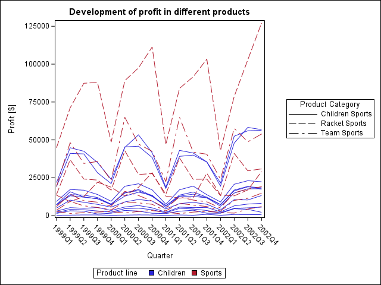

<!-- Load all necessary libraries -->
```{r setup, include=FALSE}
dir.create("./fig")
# load the SASmarkdown package
library(SASmarkdown)
```

<!-- Add an explanation -->
With the following code, you can generate a spaghetti plot in SAS. This is useful for showing longitudinal data of different group or individual patients. The example plot is grouped by several different variables:

* `group=`: individual lines, e.g. data of one individual patients,
* `grouplc=`: line colours, e.g. treatment group, and
* `grouplp=`: line pattern, e.g. belonging to the per-protocol set or not.

<!-- Load the code from an external file -->
It is generated by the SAS procedure `proc sgplot` using the code below:
```{r plot, file="spaghetti-plot.sas", echo=TRUE, engine="sashtml", engine.path = "C:\\Program Files\\SASHome\\SASFoundation\\9.4\\sas.exe"}
```

<!-- Show the plot -->
